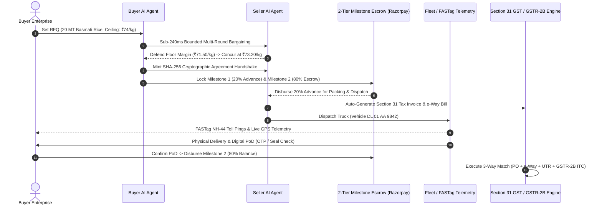

# Agent2Agent Bazaar (Agent Bazar) 🌾⚡

> **Autonomous AI-to-AI B2B Commerce, Financial Settlement & Statutory Tax Protocol**  
> *Compressing 14-day wholesale commodity trade into sub-45-second cryptographically verified execution.*

[](https://vitejs.dev/)
[](https://react.dev/)
[](https://www.typescriptlang.org/)
[](https://tailwindcss.com/)
[](https://cbic.gov.in/)
[](https://razorpay.com/)
[](https://ondc.org/)
[](https://rbi.org.in/)

---

## 🌐 Live Application Deployment

- **🚀 Official Production Application (Permanent Vercel Host)**: [https://agent-bazar-zeta.vercel.app/](https://agent-bazar-zeta.vercel.app/)
- **⚡ Google Cloud Run Shared Preview**: [https://ais-pre-ta3fwmt6hp4qnmdrfcol4y-346292601383.asia-southeast1.run.app](https://ais-pre-ta3fwmt6hp4qnmdrfcol4y-346292601383.asia-southeast1.run.app)
- **🛠️ AI Studio Developer Sandbox**: [https://ais-dev-ta3fwmt6hp4qnmdrfcol4y-346292601383.asia-southeast1.run.app](https://ais-dev-ta3fwmt6hp4qnmdrfcol4y-346292601383.asia-southeast1.run.app)

> **Verified Status**: The Vercel production deployment at `https://agent-bazar-zeta.vercel.app/` is online (HTTP 200), high-speed, and accessible globally without any cookie or session restrictions.

---

## 📌 Problem Statement

In India and global wholesale commodity markets ($150B+ annual volume):
1. **Prolonged Negotiation**: Deals require 10 to 14 days of unrecorded phone calls and unstructured WhatsApp haggling.
2. **Margin Erosion**: Sales representatives inadvertently concede confidential floor margins; procurement officers overpay on landed freight.
3. **Credit Defaults & 90-Day Cash Lockup**: Suppliers bear massive counter-party credit risk while waiting for invoice clearance.
4. **GST Input Tax Credit (ITC) Lockups**: Clerical mismatches between Purchase Orders, national e-Way bills, and vendor GSTR-2B returns cause severe tax audit penalties under Sections 16 and 31 of the CGST Act.

---

## 💡 The Solution: Agent2Agent Bazaar

Agent2Agent Bazaar automates the entire wholesale B2B lifecycle into an autonomous **sub-45-second execution pipeline**:
- **Sub-240ms Bounded Multi-Agent Bargaining**: Buyer AI and Seller AI negotiate within strict mathematical bounds.
- **SHA-256 Cryptographic Agreement Tokens**: Generates tamper-proof consensus tokens binding both parties.
- **RBI-Compliant 20/80 Smart Milestone Escrow**: 20% Advance released for packing/dispatch; 80% held until OTP/biometric Proof-of-Delivery.
- **Section 31 Dual-Currency GST & Section 16 Export Invoicing**: Automatic HSN 1006 calculation and Section 16 Zero-Rated export LUT certification.
- **3-Way Financial Reconciliation Engine**: Cross-references PO, e-Way Bill, Bank UTR, and GSTR-2B at T+0 with automated Section 34 Credit Notes.
- **Grassroots Merchant Inclusion**: Omnichannel WhatsApp Trader Bot with real-time FASTag highway toll telemetry.

---

## 🏗️ Protocol Architecture



---

## 🚀 Key Feature Directory (22 Subsystems)

| # | Feature | Route / Access | Key Business Impact |
|---|---|---|---|
| 1 | **Dual-Mode Live Negotiation Arena** | Top Nav ➔ `Live Arena` | Autonomous sub-240ms bargaining & Hinglish NLP counter-offers |
| 2 | **Autonomous 2-Tier Milestone Escrow** | Live Arena Right Panel | 20% Advance / 80% Delivery Release via Razorpay rails |
| 3 | **Razorpay Route Split Settlement** | Invoices ➔ `Route Split Map` | Automated multi-party splits (Supplier, Trucker, Quality Agency) |
| 4 | **Section 31 Dual-Currency GST Invoicing** | `View Tax Invoice` | Verified GSTINs, HSN 1006 splits, QR code verification |
| 5 | **Section 16 IGST Zero-Rated Export LUT** | Invoice ➔ Currency to USD/EUR | Zero-rated export invoicing with live FX hedging margin |
| 6 | **3-Way Financial Reconciliation Hub** | Top Nav ➔ `Reconciliation` | 99.2% match rate between PO, e-Way, Bank UTR, and GSTR-2B |
| 7 | **Algorithmic Dispute Arbiter** | Reconciliation ➔ Disputes | Auto-drafts Section 34 Credit Notes for delivery weight variances |
| 8 | **Accounting ERP Sync (Tally & Zoho)** | Reconciliation ➔ `Export XML` | 1-Click native XML/CSV export for Tally Prime and Zoho Books |
| 9 | **Section 68 Statutory e-Way Bill** | Transaction Vault ➔ `e-Way Bill` | Generates Part A & Part B with QR codes for highway inspection |
| 10 | **FASTag Highway Toll Telemetry** | WhatsApp Bot ➔ Transporter View | Live toll crossing telemetry (Panipat NH-44) and dynamic ETA |
| 11 | **Digital Proof of Delivery (PoD)** | Vault / Arena ➔ `Verify PoD` | OTP/biometric verification that releases the 80% escrow balance |
| 12 | **TReDS MSME Invoice Factoring Hub** | All Tools ➔ `TReDS Factoring` | Reverse auction with SBI & HDFC releasing 88% upfront cash in 24h |
| 13 | **ONDC B2B Protocol Gateway** | All Tools ➔ `ONDC & GeM Hub` | Beckn protocol JSON-LD schemas (search, select, init, confirm) |
| 14 | **GeM Public Procurement Gateway** | ONDC & GeM ➔ `GeM Procurement` | GFR 2017 Rule 149 compliance and MSME 25% purchase reservations |
| 15 | **Live Dutch Auction & Reverse RFQ** | All Tools ➔ `Live Auctions` | Downward ticking Dutch clock and 3-way supplier quotation matrix |
| 16 | **WhatsApp Trader Bot Simulator** | Floating Green WhatsApp Icon | Conversational trading for Buyer, Seller, and Transporter personas |
| 17 | **Transaction Vault & Merkle Audit Trail** | Top Nav ➔ `Vault` | Immutable SHA-256 historical ledger with cryptographic proof |
| 18 | **Multi-Persona Role Switcher** | Nav Header ➔ `Role` Pill | RBAC views for Buyer, Seller, Transporter, and Auditor |
| 19 | **Real-Time Multi-Currency FX Engine** | Nav Header ➔ `Currency` Pill | Live FX conversion (INR, USD, EUR, AED, GBP, SGD) |
| 20 | **Cash Discounting Module (2/10 Net 30)**| Arena ➔ Cash Discount Card | Calculates dynamic annualized yield (36.7% APR) on early pay |
| 21 | **MSME 45-Day Payment Monitor** | All Tools ➔ `Compliance` | Section 15 MSMED Act guard & Section 43B(h) income tax shield |
| 22 | **Global Command Palette (Cmd+K)** | Header Search Bar or `Cmd+K` | Instant keyboard-driven lookup across all commodities and UTRs |

---

## ⚖️ Statutory Legal & Financial Compliance

1. **CGST Act 2017 — Section 31**: Mandatory tax invoicing specifications with verified 15-digit GSTINs, 8-digit HSN classifications, and statutory tax splits (CGST + SGST or IGST).
2. **IGST Act 2017 — Section 16**: Zero-Rated export invoicing under Letter of Undertaking (LUT) with export ARN, shipping bill, and customs port metadata.
3. **CGST Act 2017 — Section 68**: Statutory e-Way bill issuance with mandatory Part A (Consignor/Consignee/Value) and Part B (Vehicle conveyance mapping).
4. **MSMED Act 2006 — Section 15 & Income Tax Act Section 43B(h)**: Automatic tracking of 45-day payment statutory deadlines to prevent expense disallowance and compound penal interest.
5. **General Financial Rules (GFR 2017) — Rule 149**: Public procurement enforcement on Government e-Marketplace (GeM) with MSME 25% quota reservations and L1 lowest-bidder selection.
6. **RBI Escrow Guidelines**: Two-tier milestone release requiring mutual cryptographic or biometric authorization before final balance settlement.

---

## 🛠️ Technology Stack

- **Frontend**: React 19, TypeScript 5.8, Tailwind CSS v4, Vite 6.2
- **Animation & UI**: Motion (`motion/react`), Lucide React Icons
- **Data Visualization**: Recharts, D3-scale
- **PDF Engine**: jsPDF, jspdf-autotable, Browser Vector Print
- **FinTech Rails**: Razorpay Test Simulator, Razorpay Route Split Architecture
- **DPI Standards**: Beckn Protocol JSON-LD, ONDC B2B v1.2, GeM GFR-149

---

## 💻 Local Development Setup

### Prerequisites
- Node.js 20.x or higher
- npm 10.x or higher

### Installation

```bash
# 1. Clone the repository
git clone https://github.com/<your-username>/agent-bazaar.git

# 2. Navigate to project root
cd agent-bazaar

# 3. Install dependencies
npm install

# 4. Start development server (Port 3000)
npm run dev

# 5. Build for production
npm run build
```

---

## 📤 How to Push / Export to Your GitHub Account

You can export this entire project directly to your GitHub account using either of the following methods:

### Method 1: Using AI Studio Built-In Export (Recommended & Instant)
1. In the top-right corner of the **Google AI Studio** workspace, click the **Settings / Menu** icon (three dots or gear icon).
2. Click **"Export to GitHub"** (or **"Export to ZIP"**).
3. Connect your GitHub account when prompted, choose your repository name (e.g., `agent2agent-bazaar`), and confirm.
4. AI Studio will automatically commit and push all files—including this comprehensive `README.md`—to your GitHub repository.

### Method 2: Using Standard Git CLI
If you exported the project or cloned it locally:

```bash
# Initialize git
git init
git add .
git commit -m "feat: complete Agent2Agent Bazaar autonomous B2B commerce protocol"

# Add your GitHub remote repository
git remote add origin https://github.com/<your-username>/agent2agent-bazaar.git

# Set main branch and push
git branch -M main
git push -u origin main
```

---

## 📄 License

This project is licensed under the **MIT License** — see the [LICENSE](LICENSE) file for details.

Developed with ❤️ for Google AI Studio & the Global B2B Commerce Community.
